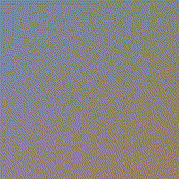
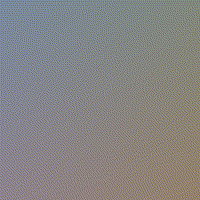

# Color Autoencoders

This is a toy project in which I fiddle with Autoencoders to see different representations of colors in 2D space.

## Results

### MSE RGB
The first method I tested was using an RGB encoding for the colors and a simple MSE loss to train the encoder. With these choices, we get the following animation:



Each frame is taken after an epoch of training. We notice that the colors get spread out in a circle according to hue (which is how the HSL color encodes hue).
Saturation is a bit harder to see, but it seems like the center of the image is less saturated than the edges. Once again, this is how saturation is represented in the HSL color representation.
It makes sense that less saturated colors would appear in the center of the image, after all, by averaging colors with different hues, grey is the expected outcome.
This might not perfectly represent saturation, but it captures at least a portion of this component, since by averaging different hues around the center of the image would result in more grey colors.
It would seem the autoencoder learned to encode color using some sort polar-ish coordinate system in which hue is encoded in the angle and saturation in the length.

This leaves us with brightness which doesn't seem to have a proper encoding. With careful consideration it may be the case that the secondary diagonal of the image represents this component.
However this representation is not stable. Since there really isn't another independent dimension to encode data, brightness is in direct conflict with the other two components.
This is what potentially results in the flickering behavior observed during training. Which corroborates with the oscillating loss after a few epochs. Since this is such a simple
network, it isn't capable of encoding all the information RGB color requires into 2 dimensions by merely using a 3x2 and a 2x3 matrices.

The flickering may also be due to too high a learning rate after around 40 epochs. I'll experiment with decaying learning rates to see if the behavior changes.

### MSE + Triplet RGB
Following the initial simple approach, I experimented with adding a triplet loss.



The idea behind the triplet loss is to approximate encodings of similar colors while separating encodings of more distinct colors. It's hard to tell the difference between both results. Apart from the rotation and reflection, the triplet loss version seems seems to be a little darker. The flickering effect is still present (which is expected).

## Remaining Questions
- Is it possible to perfectly encode R^3 into R^2 in the general case? What about when considering 8bit RGB quantization?
- How do different losses impact the resulting compression? Perhaps if there is some extra information added via the loss - maybe in a contrastive setting - a different outcome would appear.
- Do different encodings for color matter at all? After all the network only sees 3 random floating point numbers ranging from 0 to 1. Changing the interpretation of those numbers
both in input and output shouldn't affect training (although maybe generating a visually different image).
- Check if flickering is due to network training instability (high learning rate).
- Why are the colors neatly aranged in a hue "circle", rather than just having blobs of colors packed in different regions of space? Why does this happen without an explicit KL divergence term in the loss function? Perhaps the network's simplicity acts as a regularizer in this case...

## Reproducing/Running experiments
All experiments are in self contained Jupyer Notebooks. In order to run the notebook locally you'll need the following packages:
```
torch
pillow
matplotlib
```

Running the notebook will save the frames of the animation into an `images` folder. The animation can be generated by using the following FFmpeg command line:
```bash
$ ffmpeg -framerate 24 -i images/reduced_%04d.png mse_rgb.mp4
```
I recommend generating an MP4 file, since the GIF format with default configurations generates undesirable artifacts in the resulting animation.
